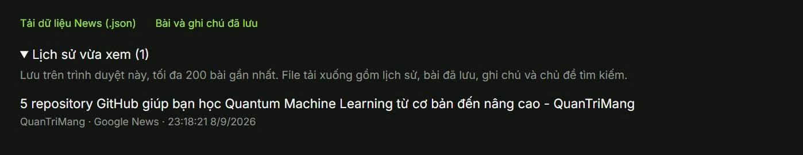
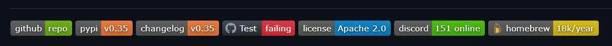

# VesperSignal News

> Công cụ tổng hợp tin tức và hỗ trợ nghiên cứu có truy xuất nguồn.

**Giai đoạn:** MVP local · **Giao diện:** Tiếng Việt / English · **AI:** Ollama · **Dữ liệu:** PostgreSQL

## Bài toán cần giải quyết

Sinh viên, người nghiên cứu và người theo dõi công nghệ thường dành nhiều thời gian tìm tài liệu trên nhiều website, mở nhiều tab, đọc thông tin lặp lại và lưu đường dẫn rời rạc. Khó khăn chính không phải thiếu thông tin, mà là lựa chọn nguồn phù hợp, hiểu nhanh nội dung và quay lại bằng chứng khi cần.

VesperSignal News tập trung giảm thời gian tìm kiếm và sàng lọc, đồng thời giữ nguồn gốc và thời gian xuất bản để người dùng đối chiếu. AI hỗ trợ đọc hiểu; quyết định về độ tin cậy và kết luận nghiên cứu vẫn thuộc người dùng.

## Người dùng và quy trình

1. Nhập chủ đề hoặc chọn danh mục như Nghiên cứu, AI, Kinh tế, Công nghệ.
2. Xem kết quả từ kho RSS và các dịch vụ tìm kiếm đa nguồn.
3. Mở bài, đọc trích đoạn hoặc tóm tắt AI, đối chiếu đường dẫn gốc.
4. Chọn nguồn để tổng hợp có trích dẫn; lưu ghi chú hoặc xuất dữ liệu.
5. Quản lý lịch sử xem và gửi đánh giá trải nghiệm.

## Phạm vi hiện có và giới hạn

| Thành phần | Phạm vi |
|---|---|
| Tìm kiếm | Tin tức, web và tài liệu nghiên cứu; không bao phủ toàn bộ Internet |
| Tóm tắt | Từ trích đoạn/abstract được cung cấp; không mặc định đã đọc toàn văn |
| Nguồn | Phân biệt nguồn chính thức, báo chí, cộng đồng và nghiên cứu sơ bộ |
| Câu chuyện | API nhóm theo tiêu đề/ngày/số liệu; chưa xác minh cùng sự kiện bằng ngữ nghĩa |
| Cá nhân hóa | API sở thích theo tài khoản và bản tin xem trước |
| Email | Cần SMTP, người nhận được phép và đăng ký nhận; mặc định tắt |
| Hỏi đáp | API truy xuất kho tin gần đây và tổng hợp có trích dẫn, có giới hạn sử dụng |
| Lịch sử | Lưu trên trình duyệt; xóa từng bài hoặc toàn bộ lịch sử; F5 không tự xóa |
| Feedback | Tự nguyện, 1–5 sao và góp ý; lưu PostgreSQL; báo cáo riêng qua gateway |

Các API MVP chưa đồng nghĩa mọi chức năng đã được đưa thành thao tác trên giao diện. Bản dịch VI/EN còn phụ thuộc kết quả xử lý AI. Tin tự cập nhật khi backend đang chạy; triển khai lên server không tự chứng minh độ chính xác hoặc chất lượng sản phẩm.

## Đánh giá MVP

Mục tiêu thử nghiệm (chưa phải số liệu đã đạt):

- Ít nhất 80% kết quả trong 10 kết quả đầu phù hợp với bộ câu hỏi thử nghiệm do người đánh giá chấm.
- 100% đoạn tổng hợp có nguồn tham chiếu hợp lệ; kiểm tra thủ công xem nguồn thực sự hỗ trợ phát biểu.
- Đo thời gian từ tìm chủ đề đến lưu được một nguồn hữu ích, so với quy trình tìm thủ công.
- Đo tỷ lệ lỗi nguồn, độ trễ cập nhật và tỷ lệ tạo tóm tắt thành công.
- Với nhóm sự kiện, ưu tiên giảm gộp nhầm; đánh giá trên các cặp bài được gán nhãn thủ công.
- Thu điểm hài lòng và góp ý, không suy diễn điểm trung bình khi chưa có đủ mẫu.

## Feedback và quyền kiểm soát dữ liệu

Lời mời đánh giá chỉ xuất hiện sau tối thiểu một phút trên trang và có lịch sử xem. Người dùng có thể mở form chủ động hoặc chọn để sau. Đã gửi thì không tự mời lại trên trình duyệt đó. Form chỉ gửi số sao, góp ý và ngôn ngữ, không gửi lịch sử đọc. Không yêu cầu tên/email.

Lịch sử đọc và ghi chú lưu ở trình duyệt hiện tại; nút tải JSON xuất bản sao để người dùng tự giữ. Xóa lịch sử không xóa bài đã đánh dấu hoặc ghi chú. Phản hồi được lưu trong bảng `news_feedback`; endpoint báo cáo yêu cầu gateway và không được công khai qua frontend. Trước khi phát hành công khai cần xác định chính sách lưu giữ và đầu mối xử lý yêu cầu dữ liệu.

## Hình minh họa do chủ dự án cung cấp

### Lịch sử xem

Hình trên ghi lại giao diện trước thay đổi; chức năng mới bổ sung xóa từng mục và xóa lịch sử.

### Mẫu trình bày badge

Đây là ảnh tham khảo từ chủ dự án, **không phải badge trạng thái của VesperSignal**. Các nhãn phiên bản, giấy phép Apache 2.0, số thành viên và trạng thái test trong ảnh không đại diện cho dự án này. Chỉ gắn badge CI, repo hoặc giấy phép thật khi đã có URL và cấu hình tương ứng.

## Điều kiện trước khi phát hành

Kiểm thử quy trình tìm–đọc–lưu–xóa–feedback; cấu hình bí mật ở server; giới hạn request tại reverse proxy tin cậy; kiểm tra quyền truy cập API báo cáo; kiểm tra phục hồi dữ liệu và giám sát lỗi nguồn. Việc đánh giá sản phẩm cần dựa trên kết quả thử nghiệm ở trên, không chỉ trạng thái deploy thành công.
